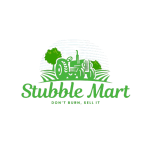

# Stubble Mart: Revolutionizing Agricultural Waste Management



## Table of Contents
- [Project Overview](#project-overview)
- [Problem Statement](#problem-statement)
- [Our Solution](#our-solution)
- [Key Features](#key-features)
- [Tech Stack](#tech-stack)
- [Architecture](#architecture)
- [Getting Started](#getting-started)
- [API Documentation](#api-documentation)
- [Frontend](#frontend)
- [Backend Structure](#backend-structure)
- [Database Schema](#database-schema)
- [Environmental Impact](#environmental-impact)
- [Business Model](#business-model)
- [Future Roadmap](#future-roadmap)
- [Team](#team)
- [Contributing](#contributing)
- [License](#license)

## Project Overview

Stubble Mart is an innovative platform designed to address the critical issue of stubble burning in Northern India, particularly in Punjab and Haryana. By connecting farmers with industries that can utilize agricultural residue, we aim to transform stubble from a liability into a valuable resource. Our solution not only tackles a significant environmental challenge but also creates new income streams for farmers and supports sustainable industrial practices.

## Problem Statement

Stubble burning in Northern India has escalated into a severe environmental and public health crisis. The practice releases toxic pollutants, degrades air quality, and contributes to numerous health issues. Despite its harmful effects, farmers continue this practice due to the lack of cost-effective alternatives for managing crop residue within the narrow timeframes between harvest cycles.

## Our Solution

Stubble Mart offers a comprehensive, scalable solution to the stubble burning problem:

1. **Digital Marketplace**: A platform connecting farmers directly with industries that require stubble for various purposes.
2. **Service Integration**: Offering stubble cutting, transportation, and machine rental services.
3. **AI-Driven Recommendations**: Personalized suggestions for farmers based on their specific needs and conditions.
4. **Multilingual Support**: Available in Hindi, Punjabi, and English to ensure accessibility for all farmers.

## Key Features

- **User Authentication**: Secure signup and login system with email verification.
- **Farmer Dashboard**: Manage stubble listings, service requests, and earnings.
- **Buyer Interface**: For industries to browse and purchase available stubble.
- **Service Booking**: Integrated system for booking cutting, transportation, and machine rental services.
- **AI-Powered Voice Assistance**: For easy navigation and use of the platform.
- **Real-time Analytics**: Track stubble availability, prices, and market trends.
- **Payment Integration**: Secure payment gateway for transactions.
- **Feedback System**: To maintain quality and trust in the platform.

## Tech Stack

### Backend
- Node.js with Express.js
- MongoDB with Mongoose ODM
- JSON Web Tokens (JWT) for authentication
- Nodemailer for email services
- Multer for file uploads

### Frontend
- React with Vite
- Tailwind CSS for styling
- Lucide React for icons
- Framer Motion for animations
- React-chartjs-2 for data visualization

### DevOps & Tools
- Git for version control
- GitHub Actions for CI/CD
- Docker for containerization
- Jest for unit testing


## Architecture

Stubble Mart follows a microservices architecture to ensure scalability and maintainability:

1. **Auth Service**: Handles user authentication and authorization.
2. **Farmer Service**: Manages farmer profiles and stubble listings.
3. **Buyer Service**: Handles buyer profiles and purchase requests.
4. **Service Booking**: Manages the booking of cutting, transportation, and rental services.
5. **Payment Service**: Integrates with payment gateways and manages transactions.
6. **Analytics Service**: Processes data for insights and recommendations.
7. **Notification Service**: Handles all system notifications and alerts.

## Getting Started

### Prerequisites
- Node.js (v14 or later)
- MongoDB
- npm or yarn

### Installation

1. Clone the repository:
   ```
   git clone https://github.com/Yashmittal4/stubble-mart.git
   cd stubble-mart
   ```

2. Install dependencies:
   ```
   npm install
   ```

3. Set up environment variables:
   ```
   cp .env.example .env
   ```
   Edit the .env file with your configuration.

4. Start the development server:
   ```
   npm run dev
   ```

5. Visit `http://localhost:5000` in your browser.


## Frontend

The frontend is built with React and Vite, offering a responsive and intuitive user interface. Key components include:

- Dashboard for farmers and buyers
- Stubble listing and search functionality
- Service booking interface
- Analytics and reporting tools

To run the frontend separately:

```
cd frontend
npm install
npm run dev
```

## Backend Structure

The backend follows a modular structure for easy maintenance and scalability:

```
├── config/
│   └── database.js
├── controllers/
│   ├── authController.js
│   ├── farmerController.js
│   ├── buyerController.js
│   └── serviceController.js
├── models/
│   ├── User.js
│   ├── Stubble.js
│   ├── Service.js
│   └── Transaction.js
├── routes/
│   ├── auth.js
│   ├── farmers.js
│   ├── buyers.js
│   └── services.js
├── middleware/
│   ├── auth.js
│   └── errorHandler.js
├── utils/
│   ├── emailService.js
│   └── aiRecommendation.js
└── server.js
```

## Database Schema

### User
- `_id`: ObjectId
- `name`: String
- `email`: String
- `password`: String (hashed)
- `role`: String (enum: ['farmer', 'buyer', 'admin'])
- `isVerified`: Boolean

### Stubble
- `_id`: ObjectId
- `farmerId`: ObjectId (ref: User)
- `type`: String
- `quantity`: Number
- `price`: Number
- `location`: {
    `lat`: Number,
    `long`: Number
  }
- `status`: String (enum: ['available', 'sold', 'in-transit'])

### Service
- `_id`: ObjectId
- `type`: String (enum: ['cutting', 'transportation', 'rental'])
- `providerId`: ObjectId (ref: User)
- `price`: Number
- `availability`: Boolean

### Transaction
- `_id`: ObjectId
- `buyerId`: ObjectId (ref: User)
- `sellerId`: ObjectId (ref: User)
- `stubbleId`: ObjectId (ref: Stubble)
- `amount`: Number
- `status`: String (enum: ['pending', 'completed', 'failed'])

## Environmental Impact

By providing an alternative to stubble burning, Stubble Mart aims to:

- Reduce air pollution and improve air quality in Northern India
- Decrease greenhouse gas emissions
- Promote sustainable farming practices
- Contribute to better soil health by encouraging stubble incorporation

## Business Model

1. **Transaction Fees**: A small percentage fee on each stubble sale.
2. **Service Charges**: Fees for cutting, transportation, and machine rental services.
3. **Premium Features**: Advanced analytics and priority listing for farmers and buyers.
4. **Partnerships**: Collaborations with agricultural equipment manufacturers and sustainable energy companies.

## Future Roadmap

1. **IoT Integration**: Smart devices for real-time monitoring of stubble quantity and quality.
2. **Machine Learning**: Advanced predictive analytics for stubble yield and market demand.
3. **Mobile App Development**: Native mobile applications for easier access on smartphones.
4. **International Expansion**: Adapting the model for other regions facing similar challenges.

## Contributing

We welcome contributions to Stubble Mart! Please see our [CONTRIBUTING.md](CONTRIBUTING.md) file for details on how to get started.

## License

This project is licensed under the MIT License - see the [LICENSE.md](LICENSE.md) file for details.

---

Stubble Mart - Transforming Agricultural Waste into Opportunity
```

